# Labpy04
## List
 • List (Daftar) adalah salah satu typedata yang paling sering digunakan pada bahasa pemograman pyton\
 • Pada pemrograman Python, List dibuat dengan menempatkan semua item (elemen) di dalam kurung siku [], dipisahkan dengan tanda koma.\
 •Untuk mengakses nilai dalam daftar, gunakan tanda kurung siku untuk mengiris bersama dengan indeks atau indeks untuk mendapatkan nilai yang tersedia pada indeks tersebut.\
 • Indeks dimulai dari 0. Jadi, daftar yang memiliki 5 elemen akan memiliki indeks dari 0 ke 4.\
 • Indeks harus bilangan bulat.
1. contoh cara mengakses element dari list\
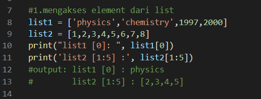 \
 penjelasan :\
 list1 = ['physics','chemistry',1997,2000]\
 print list [0]\
 karena dimulai dari 0 maka outputnya adalah physics

2. contoh mengiris list \
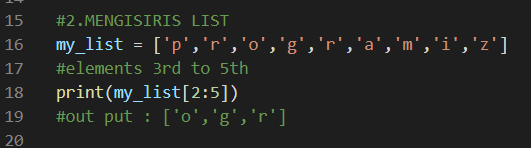 \
penjelasan :\
my_list = ['p','r','o','g','r','a','m','i','z'] \
print my_list[2:5] \
disini di minta element ke 2 sampai ke 5 \ 
maka outputnya o,g,r \
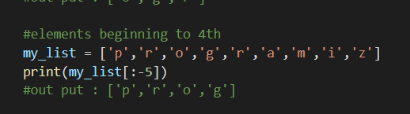 \
my_list = ['p','r','o','g','r','a','m','i','z']
print(my_list[:-5]) \
disini di minta elemen pertama sampai elemen 4 maka hasilnya : 'p','r','o','g' \

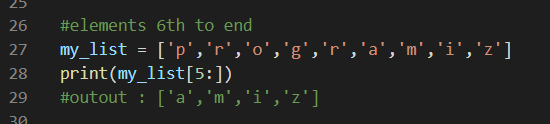 \
my_list = ['p','r','o','g','r','a','m','i','z']\
print(my_list[5:])\
disini diminta elemen ke 5 sampai terakhir maka hasil nya 'a','m','i','z'\

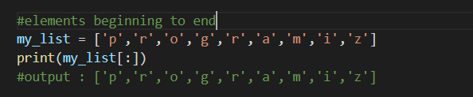 \
my_list = ['p','r','o','g','r','a','m','i','z']\
print(my_list[:]) \
disini di minta semua element maka hasil nya\
 'p','r','o','g','r','a','m','i','z' 

3. mengubah list \
 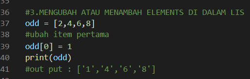 \
odd = [2,4,6,8] \
odd[0] = 1 \
print(odd) \
karena elemen pertama di ubah menjadi 1 maka : ['1','4','6','8'] \

#contoh lagi cara mengubah item ke 2 sampai ke 4 \
odd = [1,4,6,8] \
odd [1:4] = [3,5,7] \
print(odd) \
maka hasilnya ['1','3','5','7'] \
element ke 1 adalah 4 digantikan dengan 3 element ke 2 adalah 6 digantikan dengan 5 element ke 3 adalah 8 digantikan dengan 7 \
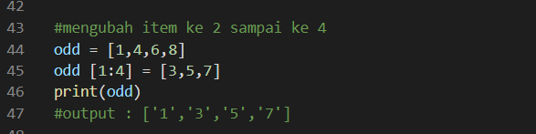

#menambah element, bisa menggunakan append\
contoh\
odd = [1,3,5] \
odd.append(7) \
print(odd) \
list dari odd di tambah 7 maka hasilnya : \
['1','3','5','7'] \
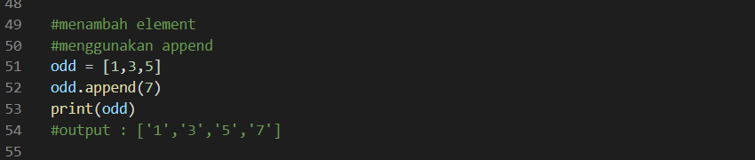

#menggunakan extend untuk menambahkan beberapa element \
odd = [1,3,5,7] \
odd.extend([9,11,13]) \
print(odd) \
hasilnya adalah : ['1','3','5','7','9','11','13']\
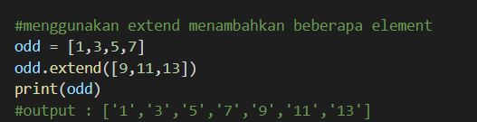

#bisa juga menggunakan operator + untuk menggabungkan 2 list\
odd = [1,3,5]\
print(odd + [9,7,5])\
maka hasilnya adalah : [1,3,5,9,7,5]\
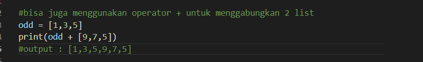

#untuk mengulang beberapa kali element pada list bisa menggunakan operator * \
print (["re"]*3) \
hasilnya:["re","re","re"] \
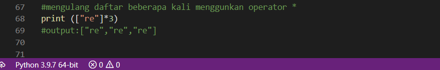 \

4. REMOVE ELEMENT \
#menghapus item dari list menggunakan del \
Kita dapat menghapus satu atau lebih item dari daftar menggunakan kata kunci del. \
Dia bahkan dapat menghapus daftar seluruhnya \
contoh menghapus satu element : \
my_list = ['p','r','o','b','l','e','m'] \
del my_list[2] \
print(my_list) \
maka ouputnya akan : ['p','r','b','l','e','m'] \

5. TUPPLE
 Tuple sama sperti list,hanya saja pada tuple datanya bersifat tetap atau tidak dapat di ubah ubah.\
 Contoh : \
 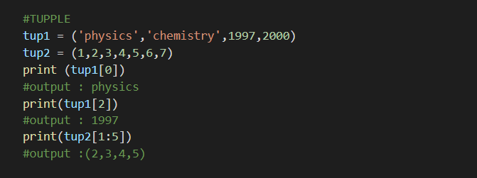 \

6. Dictionary \
Dicttionari adalah koleksi pasangan item item berasosiasi dimana setiap pasangan terdiri dari suatu key dan value. \
pasangan key-value ini ditulis sebagai key:value.\
dictionaries ditulis dipisahkan koma dalam kurung kurawal. \
contoh : \
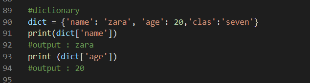 \

Untuk menghapus bisa menggunakan:\
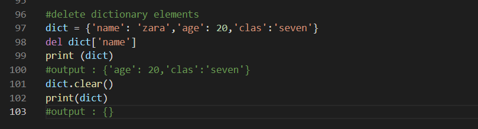 \